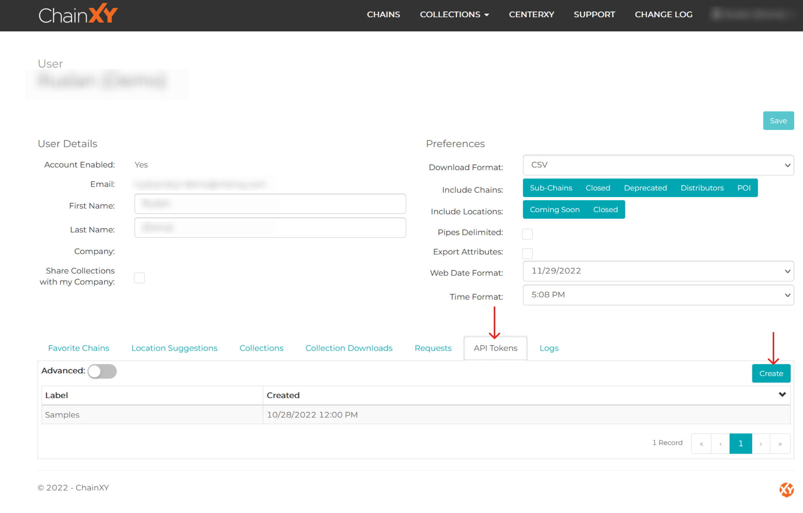

# ChainXY API Guide

Provides an overview of using the ChainXY REST API.

## Authentication

All requests to ChainXY require an API token. You can generate a token on your user page, by selecting API Tokens → Create. 

- Make sure to save the key as it is only displayed once and can not be retrieved
- If you don’t have the API Tokens option in your user settings, please reach out to support@chainxy.com

## Using the API

You can see all the available endpoints & methods using the [Swagger UI](https://location.chainxy.com/swagger/ui/index](https://location.chainxy.com/swagger/index.html) .

**URL**: `GET https://location.chainxy.com/api/[ResourceName]`

### Query Parameters:

- `OrderBy=[ColumnName|Path]`: specify a column to sort the resulting records (prefix with `` to sort descending)
    - `Path`: a path to a column name, path segments are joined using `/` (e.g. to access the Name of the Chain from a ChainScrape: `Chain/Name`)
- `Query=[QueryObject]`: specify a query object to filter returned records
    - `QueryObject`: a JSON array containing query objects/conditions. Records matching any of the elements in the array are returned.
        - A condition consists of a `ColumnName` or `Path` as a key mapped to a `SearchTerm`. Records matching all of the conditions are returned. To search with the same term in multiple columns / paths at the same time (OR query), `ColumnName` and `Path` can be joined using `|`.
            - *plain string*: searches using `contains` in the provided fields (case insensitive) - meaning that a keyword is used as a wildcard
            - *plain number*: returns records matching the number exactly (e.g. useful for searching the `Id` column)
            - *less than / greater than search*: searches numerical or datetime values prefixed with `>` or `<`, e.g. `"<4"` or `">11/1/2017"`
            - *interval search*: searches numerical or datetime values within an interval, e.g. `"[4,7]"` or `"[11/1/2017,12/1/2017]"`
            - an array of any of the above, to return records matching any of the elements in the array (`or` query
- `Fields`: a comma-separated list of field names to include in the response (e.g. `Id,Name,Status,LocationCount,LastScrapeDate`), this applies only to the main resource being requested, not any related entities that might be included in the response.
- `Limit=[Limit]`: limit the number of records returned, defaults to `100`
- `Page=[Page]`: specify the page to be returned, defaults to `0`

### Example calls:

Lets say you want to get the latest location information for Walmart and Target stores in the US. Before we can query individual locations, we need to know what `ChainIds` we are looking for.

**Getting Chain Info**

If you are trying to identify a specific chain for subsequent calls, you can go to [https://location.chainxy.com/api/Chains](https://location.chainxy.com/api/Chains) and see all the properties available for querying. Based on the structure of the response, we can determine that to find the Chain Ids for Walmart USA a request would look something like this: `https://location.chainxy.com/api/Chains?query={"Name":["Walmart","Target"],"Countries":{"Name":"United States of America"}}`

**Getting Locations for a Chain**

Based on the response from the call above, we can see that for Walmart USA its `ChainId=5227`  and for Target USA its `ChainId=4713`. We can now use this information to query latest locations for Walmart and Target. We can use the `api/Locations` endpoint for this. Based on the documentation from [Swagger UI](https://location.chainxy.com/swagger/ui/index)  we know that we can pass `ChainIds` as a comma-separated list of search parameters: [`https://location.chainxy.com/api/Locations?ChainIds=5227,4713&North=90&East=180&South=-90&West=-180`](https://location.chainxy.com/api/Locations?ChainIds=5227,4713&North=90&East=180&South=-90&West=-180)

- Note that the bounding box parameters (North, East, South, West) are required for the `api/Locations` endpoint.

## Samples Provided

Provide a skeleton for common API use cases.

1. [createCollectionAndDownload.py](python/createCollectionAndDownload.py) - Using a provided list of Chain Ids, this will create a collection with a specified name and download the most recent set of locations for that collection.
    - input: list of Chain Ids, collection name
    - Output: ChainXY collection download (note that All Chain downloads are only available as csv files)
2. [createCollectionDownload.py](python/createCollectionDownload.py) - Using a provided Collection Id and Collection Type, this will download that collection. If the optional cache_time is entered, it will check if a download that is not older than cache_time hours exists and will download that; otherwise, a new download will be generated.
    - Input: Collection Id, Collection Type, Cache Time (optional)
    - Output: ChainXY collection download (note that All Chain downloads are only available as csv files)
3. [generateReports.py](python/generateReports.py) - lets you generate reports and download them from the platform
    - Will allow you to generate Changes-Over-Time, Void Analysis, or Nearest reports.
    - See [Detailed Report Guide](https://chainxy-files.s3.us-west-2.amazonaws.com/docs/ChainXY+Detailed+Report+Guide.2022.pdf) for more information
    - Input: various report-specific parameters
    - Output: download link to the report
4. [DownloadAllUpdatesForChain.py](python/DownloadAllUpdatesForChain.py) - using a provided list of Chain Ids (or in a Collection), this will download all updates for those Chains.
    - Input: list of Chain IDs
    - Output: csv file
5. [DownloadChainsByLastScrapeDate.py](python/DownloadChainsByLastScrapeDate.py) - using a provided list of Chain Ids (or in a Collection) and a date, this will download a file containing all chains in the list that were scraped on or after the provided date.
    - Input: list of Chain Ids, date
    - Output: csv file
6. [DownloadLocationsByLastUpdate.py](python/DownloadLocationsByLastUpdate.py) - using a provided list of Chain Ids (or in a Collection) and a date, this will download a file containing all locations in the list of chains that were added on or after the provided date.
    - Input: list of Chain Ids, date
    - Output: csv file
